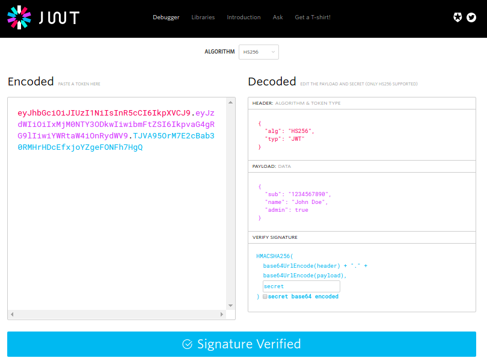

# Social Login App

### Node Passport
- Developed node js project for authentication user by social media using passportjs
- Node Project have Many social media authentication integration
- Twitter
- LinkedIn
- Facebook
- Tumblr
- Yahoo
- For integration this all functionalities we use app secret and app id for each social media provider  
- This all integration authenticate user by their account after successfully authenticate user it's return require parameter like access token, user name, unique_id and many other which node project store it in database in mongodb

### Python Script

- Python script request node project to authenticate user
- After complition of python script we integrate it with gluu server 
